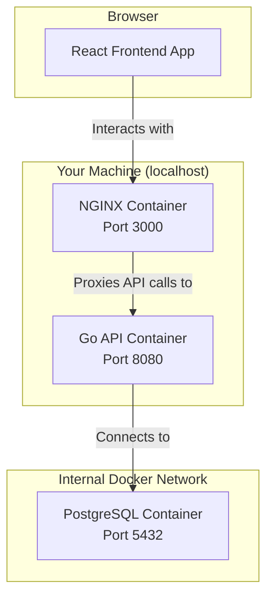

# Go E-Commerce API

[🇧🇷 Leia em Português](README.pt-br.md)


---

## 📋 Table of Contents

- [About The Project](#-about-the-project)
- [✨ Features](#-features)
- [🛠️ Tech Stack](#-tech-stack)
- [🚀 Getting Started](#-getting-started)
- [📚 API Documentation](#-api-documentation)
- [🧪 Running Tests](#-running-tests)
- [📁 Project Structure](#-project-structure)

---

## 📖 About The Project

This project implements a complete CRUD (Create, Read, Update, Delete) system for managing a product catalog. It is structured using a **Clean Architecture** approach on the backend and a **Component-Based** architecture on the frontend.
The front-end structure is together with the backend only to facilitate the evaluation of the project.

### Architecture Diagram

The application is fully containerized with Docker Compose, creating an isolated network for the services to communicate. The user interacts with the React application, which in turn communicates with the Go API.



-----

## ✨ Features

- ✅ **Full-Stack Application:** A Go backend connected to a responsive React frontend.
- 🐳 **Fully Containerized:** Docker Compose setup for one-command startup of the API, Frontend, and Database.
- 📄 **Interactive API Documentation:** Auto-generated via Swagger/OpenAPI from Go code comments.
- 🧪 **End-to-End Testing:** A robust E2E test suite for the Go API that runs in an isolated environment.
- 🗂️ **Clean Architecture:** Scalable and maintainable code structure on both backend and frontend.
- ⚙️ **Environment-based Configuration:** Simple setup using `.env` files.

-----

## 🛠️ Tech Stack

- **Backend:** Go, Chi (Router), PostgreSQL
- **Frontend:** React, Vite, Axios
- **Containerization:** Docker, Docker Compose
- **Testing:** Go's native testing package, Testcontainers-go
- **API Documentation:** Swag (OpenAPI)

-----

## 🚀 Getting Started

Follow these steps to get a local copy of the project up and running.

### Prerequisites

-   [Go](https://go.dev/dl/) (version 1.21 or higher)
-   [Docker](https://www.docker.com/get-started/) & Docker Compose 
-   A local installation of [PostgreSQL](https://www.postgresql.org/download/) if you choose not to use Docker for the database.

### Installation & Configuration

1.  **Clone the repository:**

    ```bash
    git clone https://github.com/Maria-Leiliane/go-ecommerce-base.git
    cd go-ecommerce-base
    ```

2.  **Configure Environment Variables:**
    Copy the example environment file. The default values are configured for the local development method.

    ```bash
    cp env.example .env
    ```

3.  **Install Frontend Dependencies:**

    ```bash
    cd ecommerce-frontend
    npm install
    cd .. 
    ```

### Running the Project

Choose one of the following methods to run the application.

#### Option 1: Using Docker Compose

This method builds and runs the entire full-stack application (Frontend, API, and Database) in isolated containers.

1. **Build and run all services:**

    ```bash
    docker compose up --build -d
    ```
   
2. **To view the real-time logs of the API:**

    ```bash
    docker compose logs -f api
    ```

3. **Access the application:**

    - **Frontend:** Open your browser to **`http://localhost:3000`**
    - **Backend API:** Is accessible at `http://localhost:8080`

4. **To stop and remove all containers:**

    ```bash
    docker compose down
    ```

#### Option 2: Running the Go API Locally (For Development)
This method is ideal for active development, allowing you to run the Go code directly on your machine.

**Step 1: Prepare the PostgreSQL Database**
You need a running PostgreSQL server. Choose one of the sub-options below.

* **Sub-option A: Run PostgreSQL in Docker (Recommended for consistency)**
    
  ```bash
    # This command starts a PostgreSQL container using the default credentials
    docker compose up -d postgres
    ```

* **Sub-option B: Use a Native PostgreSQL Installation**
  This assumes you have PostgreSQL server already installed on your operating system.
    1.  Open `psql` with a superuser (like `postgres`):
  
        ```bash
        sudo -u postgres psql
        ```
    2.  Run the following SQL commands to create a dedicated user and database. **Replace `myappuser` and `mypassword` with your own secure credentials.**
  
        ```sql
        CREATE DATABASE "products-db";
        CREATE USER myappuser WITH ENCRYPTED PASSWORD 'mypassword';
        GRANT ALL PRIVILEGES ON DATABASE "products-db" TO myappuser;
        \q
        ```

**Step 2: Configure `.env` and Run the Application**

1.  Open the `.env` file you created earlier.
2.  Ensure the variables match your database setup (either the Docker defaults or the ones you created in Sub-option B). `DB_HOST` must be `localhost`.

    ```ini
    DB_HOST=localhost
    DB_PORT=5432
    DB_USER=admin          # Or 'myappuser' if you used the native setup
    DB_PASSWORD=admin      # Or 'mypassword'
    DB_NAME=products-db
    ```
    
3.  Install dependencies and run the Go application:

    ```bash
    go mod tidy
    go run .
    ```
    
Your API will be available at `http://localhost:8080`.

**Run the Frontend Application without docker**
Open a **third terminal** in the frontend directory (`go-ecommerce-base/ecommerce-frontend`):

```bash
cd ecommerce-frontend
npm run dev
```

You can now access the frontend at **`http://localhost:5173`**.

-----

## 📚 API Documentation

The Go API is documented using OpenAPI (Swagger).

- **To view the interactive documentation:** With the backend running, navigate to:
  **[http://localhost:8080/swagger/index.html](http://localhost:8080/swagger/index.html)**

- **To generate/update the documentation files:**

  ```bash
  swag init -g main.go
  ```
  
-   **To test with Insomnia:** Import the pre-exported Insomnia collection located at `collection/collections-openapi.yaml`.

-----

## 🧪 Running Tests

The project includes an E2E test suite for the backend.

- **To run all backend tests:**

  ```bash
  # This command will start a temporary database container for the test
  go test -v -timeout 60s ./...
  ```

-----

## 📁 Project Structure

```
.
├── collection/          # Insomnia collection file for API testing.
├── docs/                # Auto-generated Swagger/OpenAPI documentation files.
├── ecommerce-frontend/  # React frontend application source code.
│   ├── public/          # Static assets for the frontend (like logos, favicons).
│   ├── src/             # Main source code for the React app.
│   │   ├── components/  # Reusable React components (Form, List, Header, etc.).
│   │   ├── services/    # Centralized API communication logic (axios).
│   │   └── types/       # Component typing
│   ├── Dockerfile       # Instructions to build the production frontend container.
│   └── nginx.conf       # Nginx configuration to serve the React app.
├── internal/            # Private Go application code (not importable by other projects).
│   ├── domain/          # Core business entities and repository interfaces.
│   ├── handler/http/    # HTTP handlers that manage requests and responses.
│   └── storage/         # Database repository implementation.
├── Dockerfile           # The blueprint for building the Go backend Docker image.
├── docker-compose.yml   # The orchestration file to run the full-stack application.
├── e2e_test.go          # The end-to-end test suite for the Go API.
├── go.mod / go.sum      # Go module files defining the backend's dependencies.
├── main.go              # The entry point for the Go backend application.
├── README.md            # This documentation file.
└── README.pt-br.md      # Portuguese version of this file
```