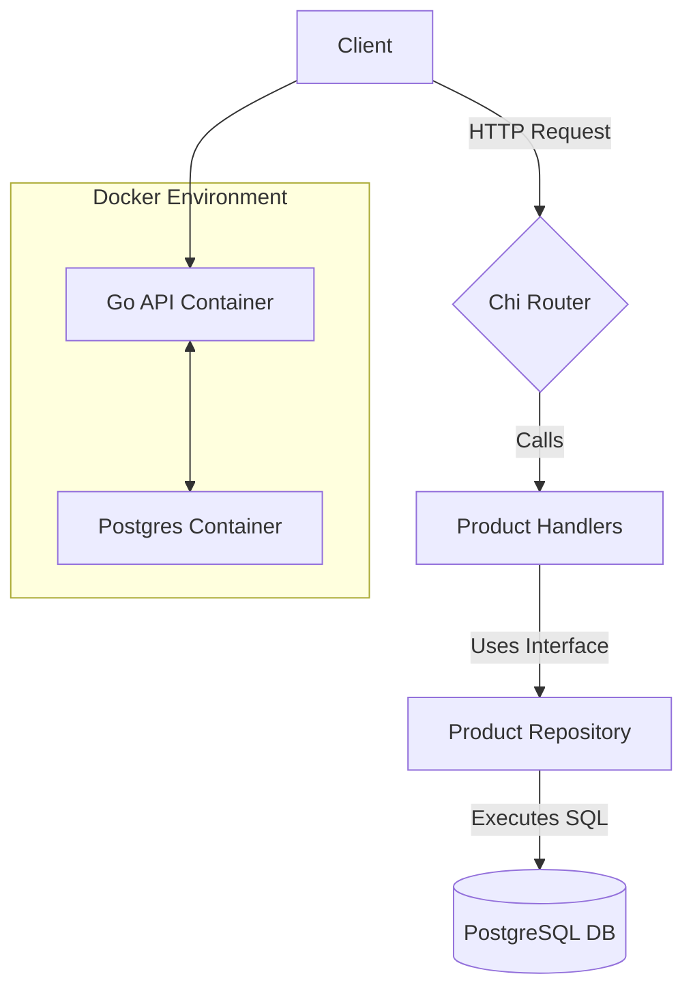

# Go E-Commerce API

[🇧🇷 Leia em Português](README.pt-br.md)


A complete and robust RESTful API for a product catalog, built with Go. This project serves as a comprehensive backend solution featuring a clean architecture, containerization, automated testing, and interactive documentation.

---

## 📋 Table of Contents

- [About The Project](#-about-the-project)
- [✨ Features](#-features)
- [🛠️ Tech Stack](#-tech-stack)
- [🚀 Getting Started](#-getting-started)
- [📚 API Documentation](#-api-documentation)
- [🧪 Running Tests](#-running-tests)
- [📁 Project Structure](#-project-structure)

---

## 📖 About The Project

This project implements a RESTful API for managing a product catalog using a **Clean Architecture** approach, clearly separating concerns into distinct layers (Domain, Storage, Handler, and Main).

### Architecture Diagram



---

## ✨ Features

-   ✅ **Full CRUD Functionality** for products.
-   🐳 **Fully Containerized** with Docker and Docker Compose for easy setup.
-   📄 **Interactive API Documentation** via Swagger UI.
-   🧪 **Unit & End-to-End Tests** for robust validation.
-   🗂️ **Clean Architecture** for maintainability and scalability.
-   ⚙️ **Environment-based Configuration** using `.env` files.

---

## 🛠️ Tech Stack

-   **Go (Golang):** Core backend language.
-   **PostgreSQL:** Relational database.
-   **Chi:** Lightweight and idiomatic HTTP router.
-   **Docker & Docker Compose:** Containerization and orchestration.
-   **Testcontainers-go:** For isolated E2E testing with a real database.
-   **Swag:** Automatic generation of OpenAPI/Swagger documentation.

---

## 🚀 Getting Started

Follow these steps to get a local copy of the project up and running.

### Prerequisites

-   [Go](https://go.dev/dl/) (version 1.21 or higher)
-   [Docker](https://www.docker.com/get-started/) & Docker Compose
-   *(Optional)* A local installation of [PostgreSQL](https://www.postgresql.org/download/) if you choose not to use Docker for the database.

### Installation & Configuration

1.  **Clone the repository:**
    ```bash
    git clone https://github.com/Maria-Leiliane/go-ecommerce-base.git
    cd go-ecommerce-base
    ```

2.  **Configure Environment Variables:**
    Copy the example environment file. This file will be used to configure the database connection.
    ```bash
    cp env.example .env
    ```
    You will edit the `.env` file in the next steps depending on the method you choose.

### Running the Project

Choose one of the following methods to run the application.

#### Option 1: Using Docker Compose (Recommended)
This method builds and runs both the API and the PostgreSQL database in isolated containers. It's the simplest and most reproducible way to get started.

1.  **Build and run the containers in the background:**
    ```bash
    docker compose up --build -d
    ```
    *(This command uses the default variables in the `docker-compose.yml` to set up the database. No `.env` modification is needed for this method unless you want to change the defaults.)*

2.  **To view the real-time logs of the API:**
    ```bash
    docker compose logs -f api
    ```

3.  **To stop and remove all containers:**
    ```bash
    docker compose down
    ```
Your API will be available at `http://localhost:8080`.

#### Option 2: Running the Go API Locally (For Development)
This method is ideal for active development, allowing you to run the Go code directly on your machine.

**Step 1: Prepare the PostgreSQL Database**
You need a running PostgreSQL server. Choose one of the sub-options below.

* **Sub-option A: Run PostgreSQL in Docker (Recommended for consistency)**
    ```bash
    # This command starts a PostgreSQL container using the default credentials
    docker compose up -d postgres
    ```

* **Sub-option B: Use a Native PostgreSQL Installation**
  This assumes you have PostgreSQL server already installed on your operating system.
    1.  Open `psql` with a superuser (like `postgres`):
        ```bash
        sudo -u postgres psql
        ```
    2.  Run the following SQL commands to create a dedicated user and database. **Replace `myappuser` and `mypassword` with your own secure credentials.**
        ```sql
        CREATE DATABASE "products-db";
        CREATE USER myappuser WITH ENCRYPTED PASSWORD 'mypassword';
        GRANT ALL PRIVILEGES ON DATABASE "products-db" TO myappuser;
        \q
        ```

**Step 2: Configure `.env` and Run the Application**
1.  Open the `.env` file you created earlier.
2.  Ensure the variables match your database setup (either the Docker defaults or the ones you created in Sub-option B). `DB_HOST` must be `localhost`.
    ```ini
    DB_HOST=localhost
    DB_PORT=5432
    DB_USER=admin          # Or 'myappuser' if you used the native setup
    DB_PASSWORD=admin      # Or 'mypassword'
    DB_NAME=products-db
    ```
3.  Install dependencies and run the Go application:
    ```bash
    go mod tidy
    go run .
    ```
Your API will be available at `http://localhost:8080`.

---

## 📚 API Documentation

This project uses `swag` to automatically generate interactive API documentation from code comments.

-   **To view the documentation:** Once the server is running, open your browser and navigate to:
    **[http://localhost:8080/swagger/index.html](http://localhost:8080/swagger/index.html)**

-   **To generate/update the documentation:**
    ```bash
    swag init -g main.go
    ```

-   **To test with Insomnia:** Import the pre-exported Insomnia collection located at `collection/collections-openapi.yaml`.

---

## 🧪 Running Tests

The project includes a full end-to-end (E2E) test suite.

-   **To run all tests:**
    ```bash
    # The timeout is increased to allow time for the Docker container to start in the E2E test.
    go test -v -timeout 60s ./...
    ```

---

## 📁 Project Structure

```
.
├── collection/         # Insomnia collection file
├── docs/               # Auto-generated Swagger/OpenAPI files
├── internal/           # Private application code
│   ├── domain/
│   ├── handler/http/
│   └── storage/
├── Dockerfile          # Instructions to build the API container
├── docker-compose.yml  # Docker Compose file for orchestration
├── e2e_test.go         # End-to-end test
├── go.mod              # Go module dependencies
├── LICENCE             # Distribution Rules
├── main.go             # Main application entry point
├── README.md           # This file
└── README.pt-br.md     # Portuguese version of this file
```