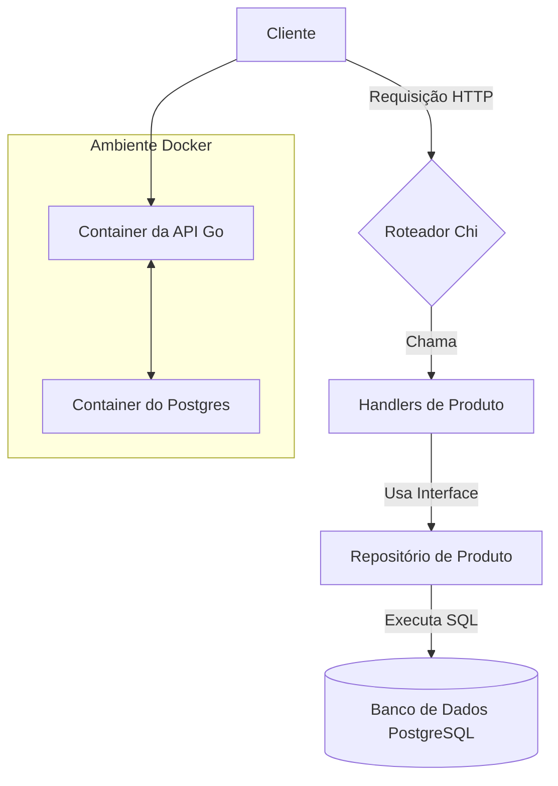

# API de E-Commerce em Go

[🇺🇸 Read in English](README.md)


Uma API RESTful completa e robusta para um catálogo de produtos, construída com Go. Este projeto serve como uma solução de backend abrangente, apresentando uma arquitetura limpa, containerização, testes automatizados e documentação interativa.

---

## 📋 Tabela de Conteúdos

- [Sobre o Projeto](#-sobre-o-projeto)
- [✨ Funcionalidades](#-funcionalidades)
- [🛠️ Tecnologias Utilizadas](#️-tecnologias-utilizadas)
- [🚀 Começando](#-começando)
- [📚 Documentação da API](#-documentação-da-api)
- [🧪 Executando os Testes](#-executando-os-testes)
- [📁 Estrutura do Projeto](#-estrutura-do-projeto)

---

## 📖 Sobre o Projeto

Este projeto implementa uma API RESTful para gerenciar um catálogo de produtos usando uma abordagem de **Arquitetura Limpa**, separando claramente as responsabilidades em camadas distintas (Domínio, Armazenamento, Handler e Main).

### Diagrama da Arquitetura



---

## ✨ Funcionalidades

-   ✅ **Funcionalidade CRUD Completa** para produtos.
-   🐳 **Totalmente Containerizado** com Docker e Docker Compose para fácil configuração.
-   📄 **Documentação da API Interativa** via Swagger UI.
-   🧪 **Testes Unitários e End-to-End** para validação robusta.
-   🗂️ **Arquitetura Limpa** para manutenibilidade e escalabilidade.
-   ⚙️ **Configuração Baseada em Ambiente** usando arquivos `.env`.

---

## 🛠️ Tecnologias Utilizadas

-   **Go (Golang):** Linguagem principal do backend.
-   **PostgreSQL:** Banco de dados relacional.
-   **Chi:** Roteador HTTP leve e idiomático.
-   **Docker & Docker Compose:** Containerização e orquestração.
-   **Testcontainers-go:** Para testes E2E isolados com um banco de dados real.
-   **Swag:** Geração automática de documentação OpenAPI/Swagger.

---

## 🚀 Começando

Siga estes passos para obter uma cópia local do projeto em execução.

### Pré-requisitos

-   [Go](https://go.dev/dl/) (versão 1.21 ou superior)
-   [Docker](https://www.docker.com/get-started/) & Docker Compose
-   *(Opcional)* Uma instalação local do [PostgreSQL](https://www.postgresql.org/download/) se você optar por não usar o Docker para o banco de dados.

### Instalação e Configuração

1.  **Clone o repositório:**
    ```bash
    git clone https://github.com/Maria-Leiliane/go-ecommerce-base.git
    cd go-ecommerce-base
    ```

2.  **Configure as Variáveis de Ambiente:**
    Copie o arquivo de ambiente de exemplo. Este arquivo será usado para configurar a conexão com o banco de dados.
    ```bash
    cp env.example .env
    ```
    Você irá editar o arquivo `.env` nos próximos passos, dependendo do método escolhido.

### Executando o Projeto

Escolha um dos métodos a seguir para executar a aplicação.

#### Opção 1: Usando Docker Compose (Recomendado)
Este método constrói e executa tanto a API quanto o banco de dados PostgreSQL em containers isolados. É a forma mais simples e reproduzível de começar.

1.  **Construa e execute os containers em segundo plano:**
    ```bash
    docker compose up --build -d
    ```
    *(Este comando usa as variáveis padrão do `docker-compose.yml` para configurar o banco. Nenhuma modificação no `.env` é necessária para este método, a menos que você queira alterar os padrões.)*

2.  **Para visualizar os logs da API em tempo real:**
    ```bash
    docker compose logs -f api
    ```

3.  **Para parar e remover todos os containers:**
    ```bash
    docker compose down
    ```
Sua API estará disponível em `http://localhost:8080`.

#### Opção 2: Rodando a API Go Localmente (Para Desenvolvimento)
Este método é ideal para o desenvolvimento ativo, permitindo que você execute o código Go diretamente na sua máquina.

**Passo 1: Prepare o Banco de Dados PostgreSQL**
Você precisa de um servidor PostgreSQL em execução. Escolha uma das sub-opções abaixo.

* **Sub-opção A: Rodar o PostgreSQL no Docker (Recomendado para consistência)**
    ```bash
    # Este comando inicia um container PostgreSQL com as credenciais padrão
    docker compose up -d postgres
    ```

* **Sub-opção B: Usar uma Instalação Nativa do PostgreSQL**
  Isto assume que você já tem o servidor PostgreSQL instalado no seu sistema operacional.
    1.  Abra o `psql` com um superusuário (como o `postgres`):
        ```bash
        sudo -u postgres psql
        ```
    2.  Execute os seguintes comandos SQL para criar um usuário e um banco de dados dedicados. **Substitua `meuusuario` e `minhasenha` por suas próprias credenciais.**
        ```sql
        CREATE DATABASE "products-db";
        CREATE USER meuusuario WITH ENCRYPTED PASSWORD 'minhasenha';
        GRANT ALL PRIVILEGES ON DATABASE "products-db" TO meuusuario;
        \q
        ```

**Passo 2: Configure o `.env` e Execute a Aplicação**
1.  Abra o arquivo `.env` que você criou anteriormente.
2.  Garanta que as variáveis correspondem à sua configuração de banco de dados (sejam os padrões do Docker ou as que você criou na Sub-opção B). `DB_HOST` deve ser `localhost`.
    ```ini
    DB_HOST=localhost
    DB_PORT=5432
    DB_USER=admin         # Ou 'meuusuario' se usou a instalação nativa
    DB_PASSWORD=admin     # Ou 'senhasegura'
    DB_NAME=products-db
    ```
3.  Instale as dependências e execute a aplicação Go:
    ```bash
    go mod tidy
    go run .
    ```
Sua API estará disponível em `http://localhost:8080`.

---

## 📚 Documentação da API

Este projeto usa `swag` para gerar documentação interativa da API a partir dos comentários do código.

-   **Para visualizar a documentação:** Com o servidor rodando, acesse:
    **[http://localhost:8080/swagger/index.html](http://localhost:8080/swagger/index.html)**

-   **Para gerar/atualizar a documentação:**
    ```bash
    swag init -g main.go
    ```

-   **Para testar com o Insomnia:** Importe a coleção pré-exportada do Insomnia localizada em `collection/collections-openapi.yaml`.

---

## 🧪 Executando os Testes

O projeto inclui uma suíte de testes end-to-end (E2E) completa.

-   **Para rodar todos os testes:**
    ```bash
    # O timeout é aumentado para dar tempo ao container Docker iniciar no teste E2E.
    go test -v -timeout 60s ./...
    ```

---

## 📁 Estrutura do Projeto

```
.
├── collection/         # Arquivo de coleção do Insomnia
├── docs/               # Arquivos auto-gerados do Swagger/OpenAPI
├── internal/           # Código privado da aplicação
│   ├── domain/         # Entidades e interfaces de negócio
│   ├── handler/http/   # Handlers e rotas HTTP
│   └── storage/        # Implementação do repositório
├── Dockerfile          # Instruções para construir o container da API
├── docker-compose.yml  # Arquivo Docker Compose para orquestração
├── e2e_test.go         # Teste end-to-end
├── go.mod              # Dependências do Go
├── LICENCE             # Regras de distribuição
├── main.go             # Ponto de entrada da aplicação
├── README.md           # Este arquivo (versão em inglês)
└── README.pt-br.md     # Versão em português deste arquivo
```