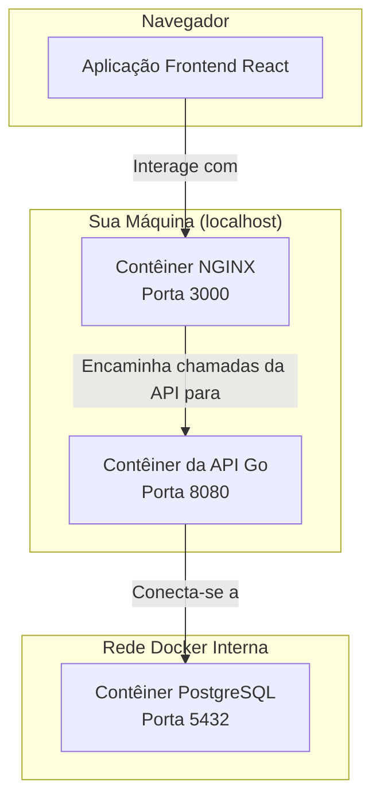

# API de E-Commerce em Go

[🇺🇸 Read in English](README.md)


---

## 📋 Tabela de Conteúdos

- [Sobre o Projeto](#-sobre-o-projeto)
- [✨ Funcionalidades](#-funcionalidades)
- [🛠️ Tecnologias Utilizadas](#-tecnologias-utilizadas)
- [🚀 Começando](#-começando)
- [📚 Documentação da API](#-documentação-da-api)
- [🧪 Executando os Testes](#-executando-os-testes)
- [📁 Estrutura do Projeto](#-estrutura-do-projeto)

---

## 📖 Sobre o Projeto

Este projeto implementa uma API RESTful para gerenciar um catálogo de produtos usando uma abordagem de **Arquitetura Limpa**, separando claramente as responsabilidades em camadas distintas (Domínio, Armazenamento, Handler e Main).

### Diagrama da Arquitetura

O aplicativo é totalmente conteinerizado com o Docker Compose, criando uma rede isolada para a comunicação dos serviços. O usuário interage com o aplicativo React, que por sua vez se comunica com a API Go.



-----

## ✨ Funcionalidades

-   ✅ **Funcionalidade CRUD Completa** para produtos.
-   🐳 **Totalmente Containerizado** com Docker e Docker Compose para fácil configuração.
-   📄 **Documentação da API Interativa** via Swagger UI.
-   🧪 **Testes Unitários e End-to-End** para validação robusta.
-   🗂️ **Arquitetura Limpa** para manutenibilidade e escalabilidade.
-   ⚙️ **Configuração Baseada em Ambiente** usando arquivos `.env`.

-----

## 🛠️ Tecnologias Utilizadas

- **Back-end:** Go, Chi (Roteador), PostgreSQL
- **Front-end:** React, Vite, Axios
- **Containerização:** Docker, Docker Compose
- **Testes:** Pacote de testes nativo do Go, Testcontainers-go
- **Documentaçã da API:** Swag (OpenAPI)

-----

## 🚀 Começando

Siga estes passos para obter uma cópia local do projeto em execução.

### Pré-requisitos

-   [Go](https://go.dev/dl/) (versão 1.21 ou superior)
-   [Docker](https://www.docker.com/get-started/) & Docker Compose *(Opcional)*  
-   Uma instalação local do [PostgreSQL](https://www.postgresql.org/download/) se você optar por não usar o Docker para o banco de dados.

### Instalação e Configuração

1.  **Clone o repositório:**

    ```bash
    git clone https://github.com/Maria-Leiliane/go-ecommerce-base.git
    cd go-ecommerce-base
    ```

2.  **Configure as Variáveis de Ambiente:**
    Copie o arquivo de ambiente de exemplo. Os valores padrão são configurados para o método de desenvolvimento local.

    ```bash
    cp env.example .env
    ```
    
3. **Instalar dependências do frontend:**

   ```bash
    cd ecommerce-frontend
    npm install
    cd .. 
    ```

### Executando o Projeto

Escolha um dos métodos a seguir para executar a aplicação.

#### Opção 1: Usando Docker Compose

Este método cria e executa todo o aplicativo full-stack (frontend, API e banco de dados) em contêineres isolados.

1. **Construa e execute os containers em segundo plano:**

    ```bash
    docker compose up --build -d
    ```

2. **Para visualizar os logs da API em tempo real:**

    ```bash
    docker compose logs -f api
    ```

3. **Acesse o aplicativo:**

   - **Frontend:** Abra seu navegador em **`http://localhost:3000`**
   - **Backend API:** Acessível em `http://localhost:8080`

4. **Para parar e remover todos os containers:**

    ```bash
    docker compose down
    ```

#### Opção 2: Rodando a API Go Localmente (Para Desenvolvimento)
Este método é ideal para o desenvolvimento ativo, permitindo que você execute o código Go diretamente na sua máquina.

**Passo 1: Prepare o Banco de Dados PostgreSQL**
Você precisa de um servidor PostgreSQL em execução. Escolha uma das sub-opções abaixo.

* **Sub-opção A: Rodar o PostgreSQL no Docker (Recomendado para consistência)**
    
  ```bash
    # Este comando inicia um container PostgreSQL com as credenciais padrão
    docker compose up -d postgres
    ```

* **Sub-opção B: Usar uma Instalação Nativa do PostgreSQL**
  Isto assume que você já tem o servidor PostgreSQL instalado no seu sistema operacional.
    1.  Abra o `psql` com um superusuário (como o `postgres`):
  
        ```bash
        sudo -u postgres psql
        ```
    2.  Execute os seguintes comandos SQL para criar um usuário e um banco de dados dedicados. **Substitua `meuusuario` e `minhasenha` por suas próprias credenciais.**
  
        ```sql
        CREATE DATABASE "products-db";
        CREATE USER meuusuario WITH ENCRYPTED PASSWORD 'minhasenha';
        GRANT ALL PRIVILEGES ON DATABASE "products-db" TO meuusuario;
        \q
        ```

**Passo 2: Configure o `.env` e Execute a Aplicação**

1.  Abra o arquivo `.env` que você criou anteriormente.
2.  Garanta que as variáveis correspondem à sua configuração de banco de dados (sejam os padrões do Docker ou as que você criou na Sub-opção B). `DB_HOST` deve ser `localhost`.

    ```ini
    DB_HOST=localhost
    DB_PORT=5432
    DB_USER=admin         # Ou 'meuusuario' se usou a instalação nativa
    DB_PASSWORD=admin     # Ou 'senhasegura'
    DB_NAME=products-db
    ```
    
3.  Instale as dependências e execute a aplicação Go:

    ```bash
    go mod tidy
    go run .
    ```
    
Sua API estará disponível em `http://localhost:8080`.

**Execute o aplicativo frontend sem o Docker**
Abra um **terceiro terminal** no diretório frontend (`go-ecommerce-base/ecommerce-frontend`):  

```bash
cd ecommerce-frontend
npm run dev
```

Agora você pode acessar o frontend em **`http://localhost:5173`**.

-----

## 📚 Documentação da API

Este projeto usa `swag` para gerar documentação interativa da API a partir dos comentários do código.

-   **Para visualizar a documentação:** Com o servidor rodando, acesse:
    **[http://localhost:8080/swagger/index.html](http://localhost:8080/swagger/index.html)**

-   **Para gerar/atualizar a documentação:**

    ```bash
    swag init -g main.go
    ```

-   **Para testar com o Insomnia:** Importe a coleção pré-exportada do Insomnia localizada em `collection/collections-openapi.yaml`.

-----

## 🧪 Executando os Testes

O projeto inclui uma suíte de testes end-to-end (E2E) completa.

-   **Para rodar todos os testes:**

    ```bash
    # O timeout é aumentado para dar tempo ao container Docker iniciar no teste E2E.
    go test -v -timeout 60s ./...
    ```

-----

## 📁 Estrutura do Projeto

```
.
├── collection/          # Arquivo de coleção do Insomnia para testes de API.
├── docs/                # Arquivos de documentação Swagger/OpenAPI gerados automaticamente.
├── ecommerce-frontend/  # Código-fonte do aplicativo frontend React.
│   ├── public/          # Recursos estáticos para o frontend (como logotipos, favicons).
│   ├── src/             # Código-fonte principal do aplicativo React.
│   │   ├── components/  # Componentes React reutilizáveis (Formulário, Lista, Cabeçalho, etc.).
│   │   ├── services/    # Lógica de comunicação de API centralizada (axios).
│   │   └── types/       # Tipagem de componentes
│   ├── Dockerfile       # Instruções para construir o contêiner frontend de produção.
│   └── nginx.conf       # Configuração do Nginx para servir o aplicativo React.
├── internal/            # Código privado do aplicativo Go (não importável por outros projetos).
│   ├── domain/          # Entidades de negócios principais e interfaces de repositório.
│   ├── handler/http/    # Manipuladores HTTP que gerenciam solicitações e respostas.
│   └── storage/         # Implementação do repositório de banco de dados.
├── Dockerfile           # O projeto para construir a imagem Docker do backend Go.
├── docker-compose.yml   # O arquivo de orquestração para executar o aplicativo full-stack.
├── e2e_test.go          # O conjunto de testes completo para a API Go.
├── go.mod / go.sum      # Arquivos do módulo Go que definem as dependências do backend.
├── main.go              # O ponto de entrada para o aplicativo de backend Go.
├── README.md            # Este arquivo (versão em inglês)
└── README.pt-br.md      # Versão em português deste arquivo
```